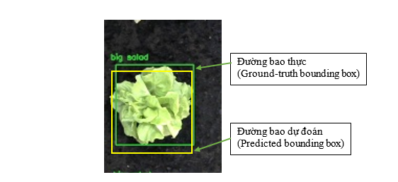
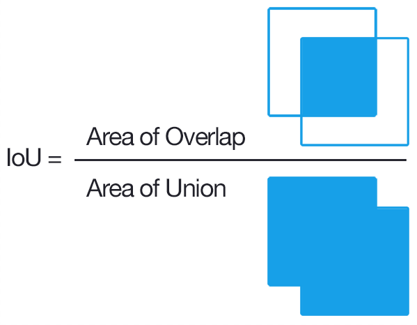
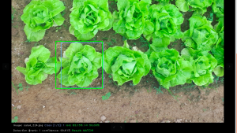
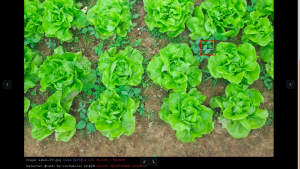
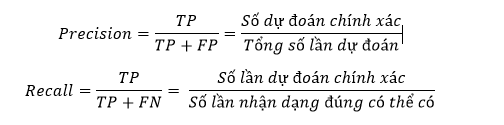
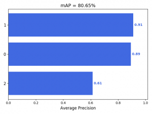

# Model evaluation using mAP
## Đánh giá model bằng mAP - Object detection
mỗi model Object detection sau khi đào tạo, cần có những thang điểm để đánh giá sự chính xác của nó
hiện tại chúng ta đánh giá một model dựa trên: loss function, IOU avg, mAP, đánh giá trực quan
nhiều bài báo cũng như các trang web lớn thường sử dụng mAP như là thước đo chính.
## khái niệm và cách tính AP,mAP.
## 1.1. Một vài khái niệm cần nắm trong việc đánh giá một model object detection.
- IOU( Intersection over union)
Intersection over Union là chỉ số đánh giá được sử dụng để đo độ chính xác của phát hiện đối tượng trên tập dữ liệu cụ thể.
Chỉ số này thường được gặp trong các Object Detection Challenge.
IOU thường được đánh giá hiệu năng của các bộ phát hiện đối tượng như HOG + Linear SVM và mạng nơ ron tích chập (R-CNN, FastR-CNN, YOLO,…).
Để áp dụng được IoU để đánh giá cần:
– Đường bao thực (ground-truth bounding box): là đường bao mà chúng ta gán cho vật thể bằng labelImg tool
– Đường bao dự đoán (predicted bouding box): là đường bao chúng ta sử dụng file Weights sau khi đào tạo để nhận dạng.
Dưới đây là ví dụ về đường bao thực và đường bao được dự đoán. Đường bao được dự đoán được vẽ bằng màu vàng, trong khi đó đường bao thực được vẽ bằng màu xanh lá. Mục tiêu ta là tính toán IoU (Intersection over Union) giữa hai đường bao

  

Tỷ lệ này là IoU (Intersection over union) là tỉ lệ giữa đo lường mức độ giao nhau giữa hai đường bao (thường là đường bao dự đoán và đường bao thực) để nhằm xác định hai khung hình có bị đè chồng lên nhau không.
Tỷ lệ này được tính dựa trên phần diện tích giao nhau gữa 2 đường bao với phần tổng diện tích giao nhau và không giao nhau giữa chúng.

  

Các tiêu chí được dùng để đánh giá:
– Đối tượng được nhận dạng đúng với tỉ lệ IOU > 0.5 (True positive : TP)

  

– Đối tượng được nhận dạng sai với tỉ lệ IOU < 0.5 (False positive : FP)

  

– Đối tượng không được nhận dạng (False negative: FN)
### Precision và Recall 
Dự đoán (Precision) đo lường mức độ chính xác là dự đoán của mô hình tức là tỷ lệ phần trăm dự đoán của mô hình là chính xác.
“Recall” đo lường như thế nào tốt mô hình tìm thấy tất cả các mẫu tích cực. Ví dụ: chúng ta có thể tìm thấy 80% các trường hợp tích cực có thể có trong các dự đoán K hàng đầu của mô hình.
Mô tả toán học của precision và recall

  

### AP và mAP
Từ precision và recall đã được định nghĩa ở trên chúng ta cũng có thể đánh giá mô hình dựa trên việc thay đổi một ngưỡng và quan sát giá trị của Precision và Recall. Khái niệm Area Under the Curve (AUC) cũng được định nghĩa tương tự. Với Precision-Recall Curve, AUC còn có một tên khác là Average precision (AP).
Giả sử có 𝑁 ngưỡng để tính precision và recall, với mỗi ngưỡng cho một cặp giá trị precision, recall là 𝑃𝑛,,=1,2,…,𝑁. Precision-Recall curve được vẽ bằng cách vẽ từng điểm có toạ độ (𝑃𝑛,) trên trục toạ độ và nối chúng với nhau. AP được xác định bằng:
𝐴𝑃=∑(𝑅𝑛−𝑅𝑛−1)𝑃𝑛𝑛
Và mAP là trung bình của AP được tính cho tất cả các lớp.

## 2. Tính toán mAP cho các bài toán Object detection.
### 2.1. Tổng quan các bước:
- Bước 1: cài thư viện cần thiết để tính toán.
- Bước 2: clone source code tính toán từ github.
- Bước 3: chọn một số ảnh để tính toán( hoặc toàn bộ dataset nếu muốn độ chính xác cao).
- Bước 4: tạo các file ground-truth ( file txt trong quá trình gán nhãn).
- Bước 5: tạo file detection result (file txt được tạo ra bằng cách sử dụng file weights).
- Bước 6: chạy code mẫu để tạo ra các biểu đồ AP và mAP như phía dưới 

Kết quả tính toán AP và mAP

  

